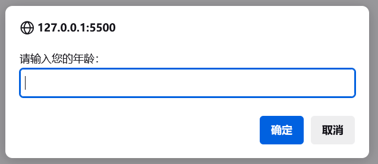

# `JS`输入输出语法

## 一、输出语法

**语法一：**

```html
<body>
  <script>
    document.write('要输出的内容')
  </script>
</body>
```

作用：向`body`内输出内容

注意：如果输出的内容写的是标签，也会被解析成网页元素


**语法二：**

```js
alert('要弹出的内容')
```

作用：页面弹出警告对话框


**语法三：**

```js
console.log('控制台打印')
```

作用：控制台输出语法，程序员调试使用


## 二、输入语法

- **语法：**

	```javascript
	prompt('请输入您的姓名：')
	```

- **作用：**显示一个对话框，对话框中包含一条文字信息，用来提示用户输入文字

- **展示：**

	 


