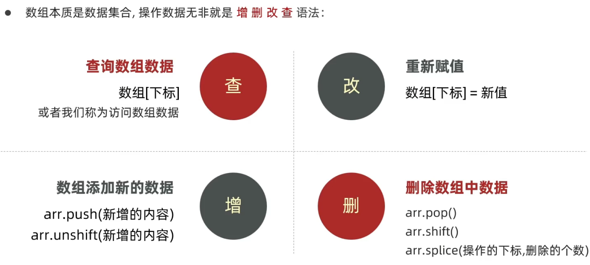

# `JS`数组

### 一、声明语法

```js
// 字面量声明
let arr = ['a', '哈哈哈哈', 'sting', 1, 3.14, false]
// new Array 声明
let arr = new Array('a', '哈哈哈哈', 'sting', 1, 3.14)
```

- 数组是按顺序保存，所以每个数据都有自己的编号
- 计算机中的编号从0开始，所以`a`的编号是0，`哈哈哈哈`的编号是1，以此类推
- 在数组中，数据是编号也叫索引或下标


### 二、获取数组的长度

通过`length`获取

```js
let arr = ['a', '哈哈哈哈', 'sting', 1, 3.14]
console.log(arr.length)
```


### 三、遍历数组

```js
let nums = [10, 20, 30, 40, 50]
for (let i = 0; i < nums.length; i++){
    document.write(nums[i])
}
```


### 四、操作数组—增删改查

 

**增：**

- `arr.push()`

	- **作用：**将**一个或多个**元素添加到数组的**末尾**，并返回该**数组的新长度**`length`

	- **语法：**

		```js
		arr.push(元素1, ..., 元素n)
		```

	- **例如：**

		```js
		let arr = ['red', 'green']
		arr.push('pink')		// 3
		console.log(arr)	// ['red', 'green', 'pink']
		```

- `arr.unshift()`

	- **作用：**将**一个或多个**元素添加到数组的**开头**，并返回该**数组的新长度**`length`

	- **语法：**

		```js
		arr.unshift(元素1, ..., 元素n)
		```

	- **例如：**

		```js
		let arr = ['red', 'green']
		arr.unshift('pink', 'yellow')		// 4
		console.log(arr)	// ['pink', 'yellow', 'red', 'green']
		```


**删：**

- `arr.pop()`

	- **作用：**从数组中删除**最后一个元素**，并返回该**元素的值**，一次只能删一个

	- **语法：**

		```js
		arr.pop()
		```

	- **例如：**

		```js
		let arr = ['red', 'green']
		arr.pop()		// green
		console.log(arr)	// ['red']
		```

- `arr.shift()`

	- **作用：**从数组中删除**第一个元素**，并返回该**元素的值**，一次只能删一个

	- **语法：**

		```js
		arr.shift()
		```

	- **例如：**

		```js
		let arr = ['red', 'green']
		arr.shift()			// red
		console.log(arr)	// ['green']
		```

- `arr.splice()`

	- **作用：**删除指定元素，指定数量

	- **语法：**

		```js
		arr.splice(start, deleteCount)
		arr.splice(起始位置, 删除几个元素)
		```

		`start`：指定删除的开始位置（从0开始）（数组索引）

		`deleteCount`：表示要删除数组元素的个数。可选的，如果省略，默认从指定的**起始位置**删除到**最后**

	- **例如：**

		```js
		let arr = ['red', 'green', 'yellow', 'blue']
		arr.splice(1, 2)	// 从green开始往后删除2个元素
		console.log(arr)	// ['red', 'blue']
		```

		```js
		let arr = ['red', 'green', 'yellow', 'blue']
		arr.splice(1)	// 从green开始删除到最后
		console.log(arr)	// ['red']
		```

		


