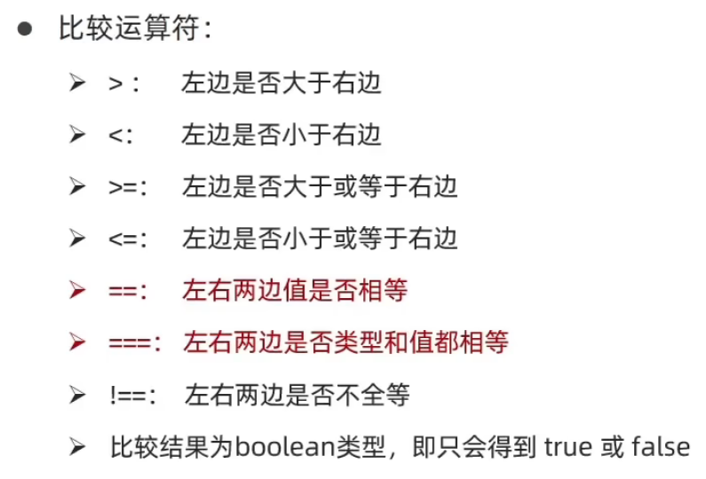

# `JS`比较运算符

 

 

```js
console.log(2 == '2')	// true
console.log(2 === '2')	// false
console.log(2 === 2)	// true
console.log(undefined == null)		// true
console.log(undefined === null)		// false
console.log(2 !== '2')		// true
console.log(NaN === NaN)	//false		NaN不等于任何数

if(a === 2){...}
```


- **字符串比较**，比较的是字符对应的`ASCII`码

	- 从左往右依次比较
	- 如果第一位一样，再比较第二位，以此类推

	```js
	console.log('a' < 'b')		//true
	console.log('aa' < 'ab')	//true
	console.log('aa' < 'aac')	//true
	```

- 尽量不要比较小数，因为小数有精度问题


