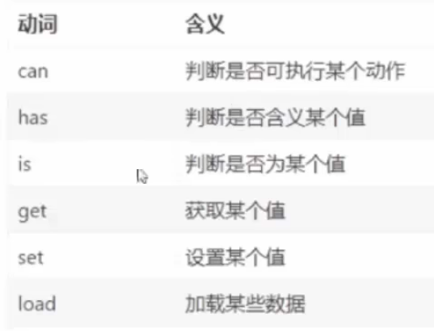

# `JS`函数

## 一、函数的基本使用

- 函数的声明：

	```js
	function 函数名() {
	    函数体
	}
	```

- 函数命名规范：
	- 和变量命名基本保持一致
	- 尽量小驼峰命名法
	- 前缀应该为动词

​				

- 函数的调用：`函数名()`

- 代码示例：

	```js
	// 函数声明
	function sayHello()
	{
	    console.log('hello JS')
	}
	// 函数调用
	sayHello()
	```

	

## 二、函数的参数

- 声明语法：

	```js
	function 函数名(参数1, 参数2...) {
	    函数体
	}
	```

- 调用语法：`函数名(传入参数)`			多个参数之间用逗号隔开

- 案例演示：

	```js
	function getSum(a, b) {
	    console.log(a + b)
	}
	getSum(10, 20)
	
	getSum()	// 不传参数，结果是undefined + undefined = NaN（不是一个数字）
	```

- 参数默认值：只会在缺少实参的时候执行

	```js
	function getSum(x = 0, y = 0) {
	    // x=0,y=0等价于下面写法
	    // x = x || 0
	    // y = y || 0
	    document.write(x + y)
	}
	getSum()		// 0
	getSum(1, 2)	// 3
	```
	
	

## 三、函数的返回值

```js
function fn() {
    // 函数返回值
    return 20
}

console.log(fn())	# 20
```


## 四、匿名函数

- 概述：没有名字的函数，无法直接使用

- 格式：

	```js
	function () {函数体}
	```

- 使用方式：

	- 函数表达式

		```js
		// 匿名函数本身没有名字，通过赋值给变量，从而实现调用，叫做函数表达式
		let fn1 = function () { }
		console.log(fn1)		# f () { }
		
		// 无参匿名函数
		let fn2 = function () {
			console.log('hello JS')
		}
		fn2()	# hello JS
		
		// 有参匿名函数
		let fn3 = function (x, y) {
			console.log(x + y)
		}
		fn3(1, 2)	# 3
		```

	- 立即执行函数：多个立即执行函数之间**必须**加分号，表示执行结束，否则会报错

		```js
		// 该函数会立即被执行
		(function (x, y) {
		    console.log(x + y)
		})(1, 2);		// 3
		
		(function () {
		    console.log('aaa')
		})();		// aaa
		
		// 用小括号将整个函数包裹起来也可以实现调用
		(function () {
		    console.log('bbb')
		}());		// bbb
		
		// 具名函数也可以写立即执行函数
		(function getSum(x, y) {
		    console.log(x + y)
		}(1, 2));		// 3
		```

		


